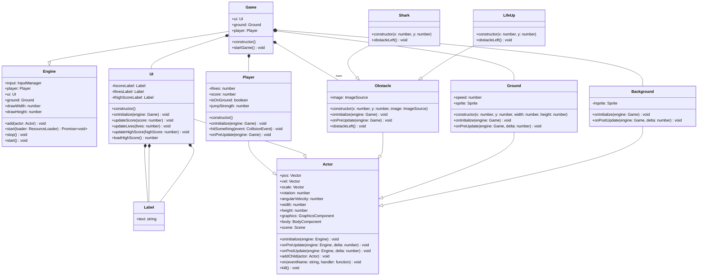

# Fast Fishy
Een endless runner game door Martijn

## Klassendiagram

```mermaid
classDiagram
    class Engine {
      +add(actor: Actor) void
      +start(loader: ResourceLoader) Promise~void~
      +stop() void
      +start() void
      +input: InputManager
      +player: Player
      +ui: UI
      +ground: Ground
      +drawWidth: number
      +drawHeight: number
    }
    class Actor {
      +pos: Vector
      +vel: Vector
      +scale: Vector
      +rotation: number
      +angularVelocity: number
      +width: number
      +height: number
      +graphics: GraphicsComponent
      +body: BodyComponent
      +scene: Scene
      +onInitialize(engine: Engine) void
      +onPreUpdate(engine: Engine, delta: number) void
      +onPostUpdate(engine: Engine, delta: number) void
      +addChild(actor: Actor) void
      +on(eventName: string, handler: function) void
      +kill() void
    }
    class Label {
      %% Excalibur Label (simplified)
      +text: string
    }

    Game --|> Engine
    Game *-- Player
    Game *-- Ground
    Game *-- UI
    Game *-- Background
    Game *-- "many" Obstacle

    Player --|> Actor

    UI --|> Actor
    UI *-- Label
    UI *-- Label
    UI *-- Label

    Obstacle --|> Actor

    Shark --|> Obstacle

    LifeUp --|> Obstacle

    Ground --|> Actor

    Background --|> Actor

    class Game {
      +ui: UI
      +ground: Ground
      +player: Player
      +constructor()
      +startGame() void
    }

    class Player {
      -#lives: number
      +score: number
      +isOnGround: boolean
      +jumpStrength: number
      +constructor()
      +onInitialize(engine: Game) void
      +hitSomething(event: CollisionEvent) void
      +onPreUpdate(engine: Game) void
    }

    class UI {
      -#scoreLabel: Label
      -#livesLabel: Label
      -#highScoreLabel: Label
      +constructor()
      +onInitialize(engine: Game) void
      +updateScore(score: number) void
      +updateLives(lives: number) void
      +updateHighScore(highScore: number) void
      +loadHighScore() number
    }

    class Obstacle {
      +image: ImageSource
      +constructor(x: number, y: number, image: ImageSource)
      +onInitialize(engine: Game) void
      +onPreUpdate(engine: Game) void
      +obstacleLeft() void
    }

    class Shark {
      +constructor(x: number, y: number)
      +obstacleLeft() void
    }

    class LifeUp {
      +constructor(x: number, y: number)
      +obstacleLeft() void
    }

    class Ground {
      +speed: number
      +sprite: Sprite
      +constructor(x: number, y: number, width: number, height: number)
      +onInitialize(engine: Game) void
      +onPreUpdate(engine: Game, delta: number) void
    }

    class Background {
      -#sprite: Sprite
      +onInitialize(engine: Game) void
      +onPostUpdate(engine: Game, delta: number) void
    }
```